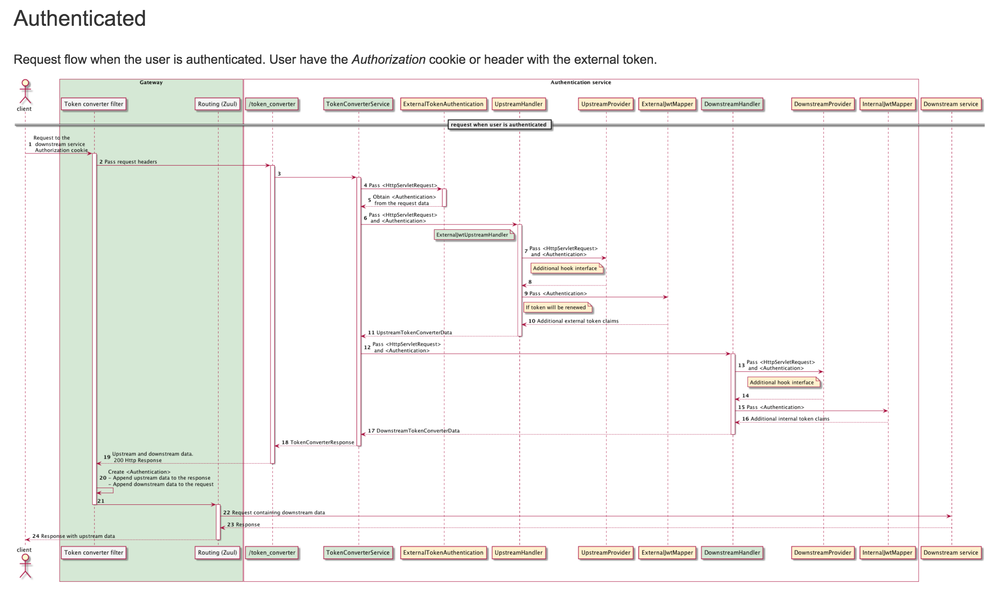

#Implement Downstream and Upstream providers

Downstream and Upstream providers are useful interfaces that can be extended to add header or cookies to request and response.

	Yellow parts are actually names of interfaces which implemented as a beans are the places where customers can hook into the flow.
Green parts are fixed and provided.



---

## Instructions: Development environment setup

In order to setup the exercise you need **Edge Service**, **Registry Service** and custom integration service which is provided for you.

## Material provided

To build this exercise we will be provided with:

* Atm Location Service

### Step 1: Start your platform services (if they are not running)

1. Follow [this guide](https://bitbucket.org/backbase/cxs-wc2-setup) to start your platform services.

2. Access [Blade console](http://localhost:8080) and check if services were successfully started.

### Step 2: Create an DownstreamProvider implementation

A primary customer identifier might be required while performing a call to the core system. We can implement a DownstreamProvider to pass this information to a downstream service as an additional HTTP Request Header.

Solve the TODO's inside the **DownstreamProviderImpl** class

### Step 3: Create a UpstreamProvider implementation

The External JWT token expires after a certain amount of time, if not renewed. The widgets want to show a popup alert to the end user when the token is i.e 60 seconds (DELTA_MILISECONDS = 60000) about to expire giving the possibility to the end user to renew the JWT token, but widgets cannot read any claim from the External JWT token because the token is encrypted.

In order to enable this feature, we can implement an UpstreamProvider which will read the expiration time claim from the token, calculate the remaining amount of SECONDS to show the popup alert, and send it back to the widget as a HTTP Response Cookie.

	NOTE: Leftover time = (expirationTimeMillis - currentTimeMillis - DELTA_MILISECONDS) / 1000

Solve the TODO's inside the **UpstreamProviderImpl** class


### Step 4: Build the project

Move into your **upstream-downstream-provider** folder and run the command:

```
mvn clean install
```

### Step 5: Run the project

In the same folder, run the command below:

```
mvn spring-boot:run
```

### Step 6: Test the Service

1. Move to `atm-location-service` folder and launch the ATM Location Service:

		mvn spring-boot:run

1. Log in through the authentication service and try log in

	[http://localhost:8080/gateway/api/auth/login](http://localhost:8080/gateway/api/auth/login)

1. Call the service and check the logs, if you can see the atm locations it means that your PARTY_ID was found in the headers and your DownstreamProvider is working.

	[http://localhost:8080/gateway/api/atm-location-service/v1/locations](http://localhost:8080/gateway/api/atm-location-service/v1/locations)

1. From your browser, check if there is a HTTP response cookie named `TimeToTokenRenewalWindowPopup`, this will validate if your UpstreamProvider is working.